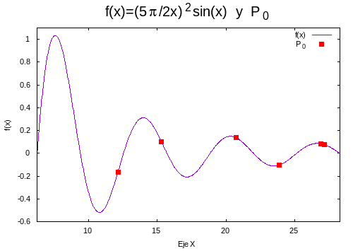
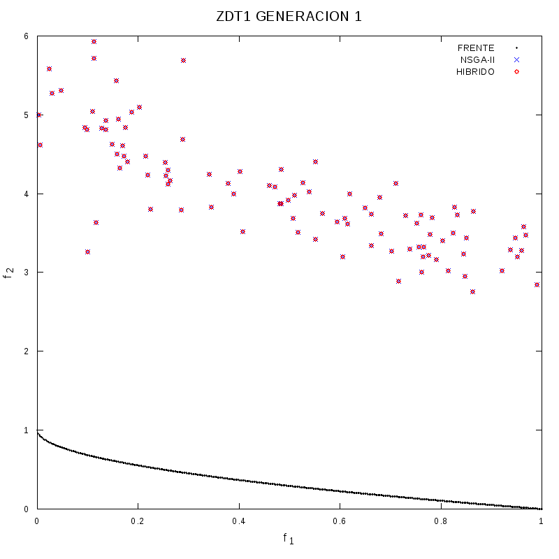
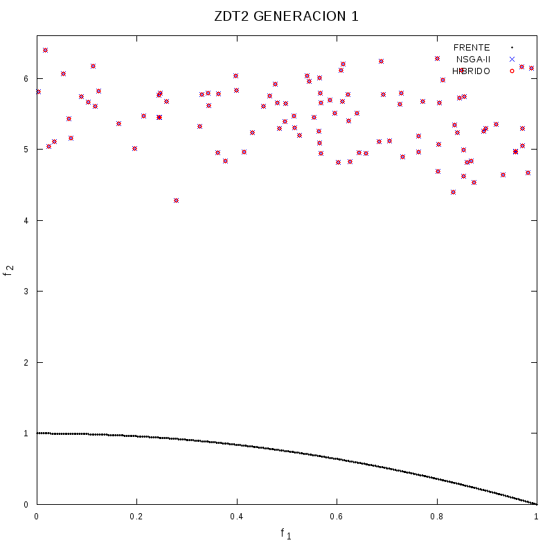
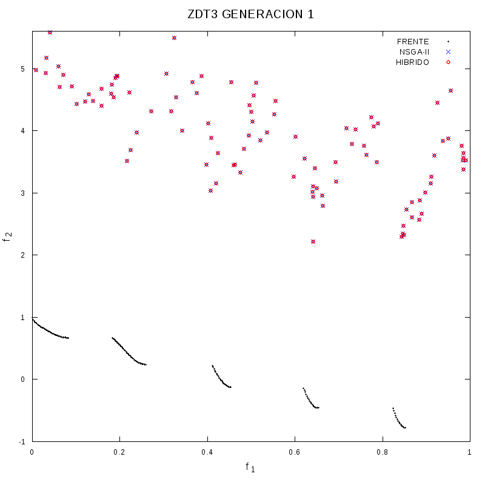
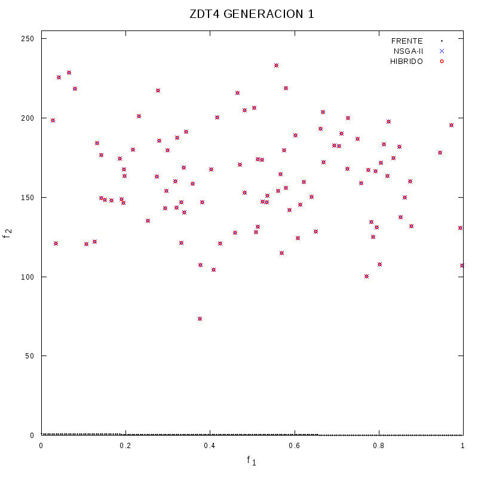
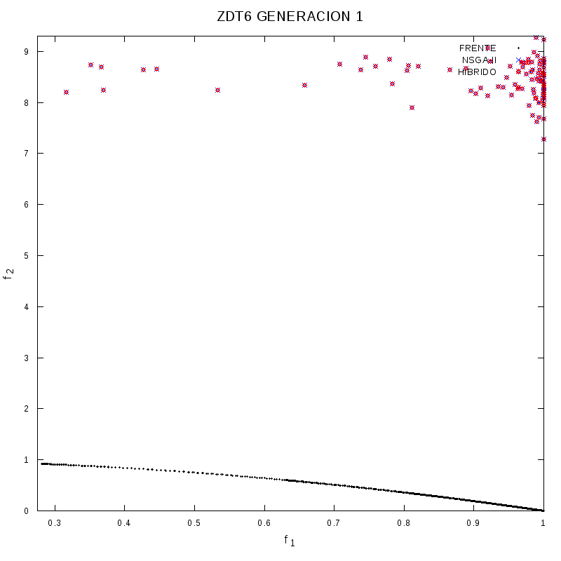

# Non-dominated Sorting Genetic Algorithm-II combined with Gradient Descent

The NSGA-II Is an optimization heuristic for multiobjective, multimodal and nonlinear objective function. This repo contains my bachelor's dissertation work called “The NSGA-II algorithm and its hybridization with a gradient based method”, which is basically a version of the original algorithm developed by Dr. Kalyanmoy Deb but combined with a gradient based method implemented by me. This repo also contains a simpler (single objective) genetic algorithm developed also by Dr. Kalyanmoy Deb for illustrative purposes.

**A small introduction to Genetic Algorithms**
---
If you wonder how these algorithms can find local solutions to optimization problems, the answer is evolution. Imagine that you have a population of individuals that interact with an environment, whose main goal is their survival and the transmission of their genes (i.e. reproduction). The success of an individual is directly determined by the environment. If an individual performs well in it (adapts), then he will survive and pass its genes to the next generation. Over the generations, individuals in the population will adapt better and better in the environment, until they dominate it in certain aspects.
In genetic algorithms like those showed here, the environment is represented by a mathematical function that we want to minimize or maximize (the objective function) and the individuals of the population by solutions to the objective function. Then, the fit of an individual (solution) in the environment,  will be the result of evaluating the objective function with this individual. For example, in the following animation we can see how a group of solutions (individuals of the population) of the objective function (environment), evolve in each generation until eventually converging to the global maximum.

  

**Dissertation Results**
---
To test the advantages of merging the NSGA-II algorithm with a gradient based method, several test functions were used. You can take a look at these results and references in my dissertation document (Documentation/ABecker_Thesis.pdf), which is in spanish unfortunately. However, here you can see some animations for the bi-objective test optimization function Zitzler–Deb–Thiele (ZDT, https://en.wikipedia.org/wiki/Test_functions_for_optimization), which show the advantages of the hybrid algorithm:

  

  

  

  

  

This dissertation is based on a paper of my advisor, the Dr. Adriana Lara López, whom I appreciate and thank very much for giving me such an interesting topic:

Authors: A. L. López, C. A. C. Coello and O. Schütze 
Title: A painless gradient-assisted multi-objective memetic mechanism for solving continuous bi-objective optimization problems 
Journal: IEEE Congress on Evolutionary Computation
Year: 2010 
Pages: 1-8 

**About the original NSGA-II Algorithm**
---
Authors: Dr. Kalyanmoy Deb, Sameer Agrawal, Amrit Pratap, T Meyarivan 
Paper Title: A Fast and Elitist multi-objective Genetic Algorithm: NSGA-II 
Journal: IEEE Transactions on Evolutionary Computation (IEEE-TEC) 
Year: 2002 
Volume: 6 
Number: 2 
Pages: 182-197
